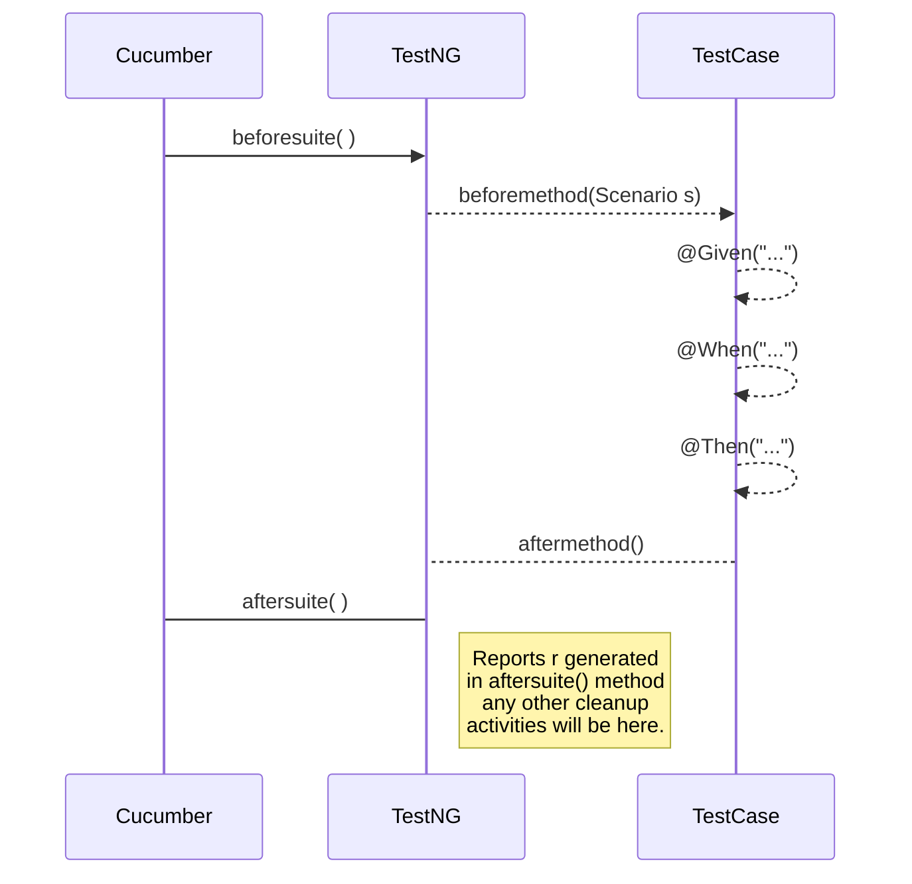

# CucumberTestNG BDD FWK!

This is a metadata driven framework built on **CucumberTestNG**. It allows Business Analysts or QA Engineers to define some custom tags in feature files, and seamlessly they will have access to appropriate test payload/input in the Test class.


# Annotations

Define Scenarios in the feature file specific naming convention **@\*Scenario\***

e.g.
- @Validation**Scenario**
- @Validation**Scenario**sForPayloadChecks
- @**Scenario**ToCheckRange

Sample feature file - 
```
@SanityModule
Feature: Payload Validations

  @ValidationScenario(jsonfile='default.json')
  Scenario Outline: Age Validation
    Given REST API is running
    When payload has age as <age>
    Then status code is <status_code> but error msg is "<error_msg>"

  Examples:
    |age  |status_code|error_msg            |
    |25   |200        |null                 |
    |150  |200        |Invalid Age          |

  @ValidationScenario(jsonfile='ip_1.json')
  Scenario: Gender Validation
    Given REST API is running
    When payload has Gender as "X"
    Then status code is 200 but error msg is "Invalid Gender"
```


## Maven build

Test cases are by default executed when we run maven build. If we want to exclude them intentionally please use below command
```
mvn clean install -DskipTests
```

## Running Tests as Java Executable Jar

Once the maven build is successful, just run the below command
```
java -jar target/gau-bdd-fwk-0.0.1-SNAPSHOT-uber.jar
```

## How executable jar has been generated

We have used ``maven-assembly-plugin`` to generate a uber jar which will contain all the **test cases, feature files, json files and testng.xml**

**pom.xml**
```
  <plugin>
    <artifactId>maven-assembly-plugin</artifactId>
    <version>2.5.5</version>
    <configuration>
      <descriptor>assembly/assembly.xml</descriptor>
      <archive>
        <manifest>
          <mainClass>com.spg.bdd.library.CucumberTestNGCmdLineRunner</mainClass>
        </manifest>
      </archive>
    </configuration>
    <executions>
      <execution>
        <id>make-assembly</id>
        <phase>package</phase>
        <goals>
          <goal>single</goal>
        </goals>
      </execution>
    </executions>
  </plugin>

```
**assembly.xml**
```
<assembly
    xmlns="http://maven.apache.org/plugins/maven-assembly-plugin/assembly/1.1.3"
    xmlns:xsi="http://www.w3.org/2001/XMLSchema-instance"
    xsi:schemaLocation="http://maven.apache.org/plugins/maven-assembly-plugin/assembly/1.1.3 http://maven.apache.org/xsd/assembly-1.1.3.xsd">
    <id>uber</id>
    <formats>
        <format>jar</format>
    </formats>
    <includeBaseDirectory>false</includeBaseDirectory>
    <dependencySets>
        <dependencySet>
            <outputDirectory>/</outputDirectory>
            <useProjectArtifact>true</useProjectArtifact>
            <unpack>true</unpack>
            <scope>test</scope>
        </dependencySet>
    </dependencySets>
    <fileSets>
        <fileSet>
            <directory>${project.build.directory}/test-classes</directory>
            <outputDirectory>/</outputDirectory>
            <includes>
                <include>**/*.class</include>
            </includes>
            <useDefaultExcludes>true</useDefaultExcludes>
        </fileSet>
        <fileSet>
            <directory>${project.directory}/src/test/resources</directory>
            <outputDirectory>/</outputDirectory>
            <includes>
                <include>**/*.*</include>
            </includes>
            <useDefaultExcludes>true</useDefaultExcludes>
        </fileSet>
        <fileSet>
            <directory>${basedir}</directory>
            <outputDirectory>/</outputDirectory>
            <includes>
                <include>*.xml</include>
            </includes>
            <useDefaultExcludes>false</useDefaultExcludes>
        </fileSet>
    </fileSets>
</assembly>
```

## Reports

We have used [cucumber-reporting](https://github.com/damianszczepanik/cucumber-reporting) framework to build our reports. Our reports output directory is configurable in our properties file. Every time we run the test cases or do a maven build (without skipping tests) a new folder is created in the reports folder with a specific naming convention (**MMddyy_HHmmss**)
e.g.
041920_082145
041920_082509
042020_153821


## UML diagrams

Complete flow diagram on how this framework works

