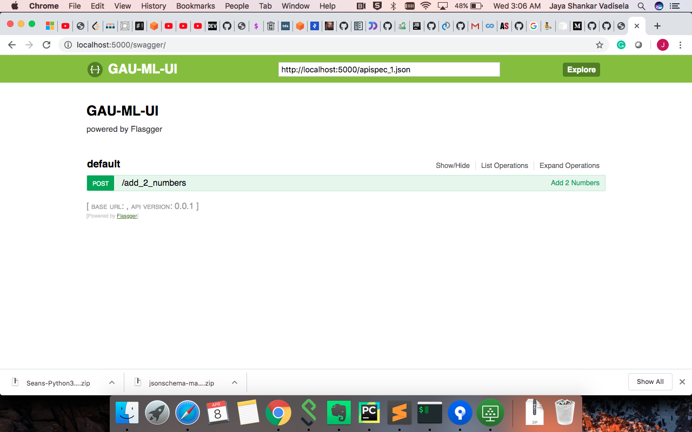

# GAU-ML
## Sample Python + Flask + Swagger + Docker Example

app can be built and run as a Docker image/container:

```
docker stop $(docker ps -a -q)
docker rm $(docker ps -a -q)
docker build -t gau-ml:latest .
docker run -d -p 5000:5000 gau-ml
```

go to: [http://localhost:5000/swagger/](http://localhost:5000/swagger/)

You should get:




